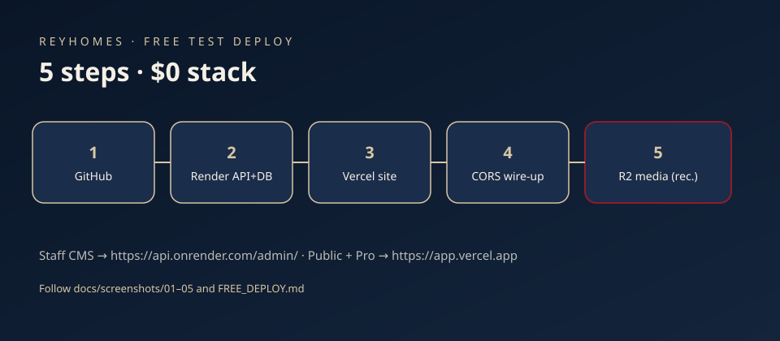
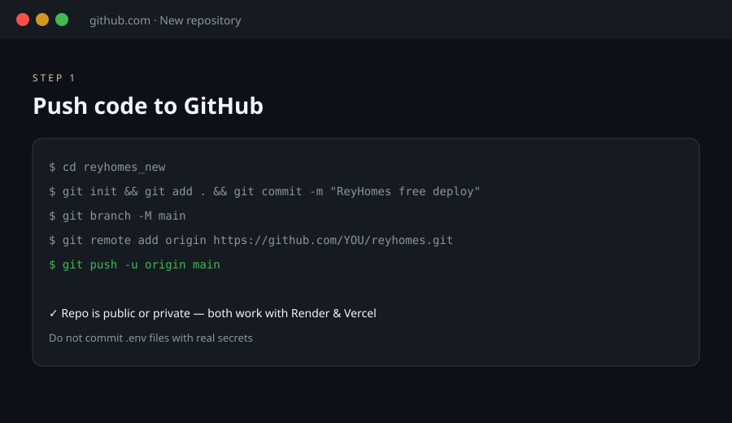
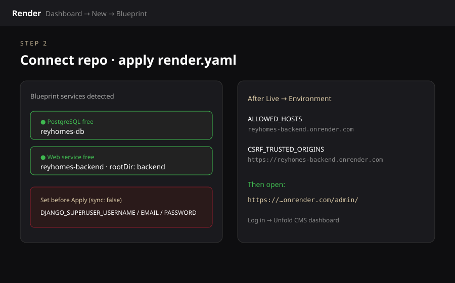
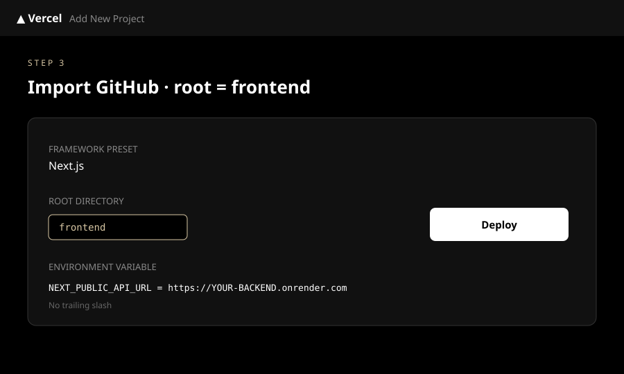
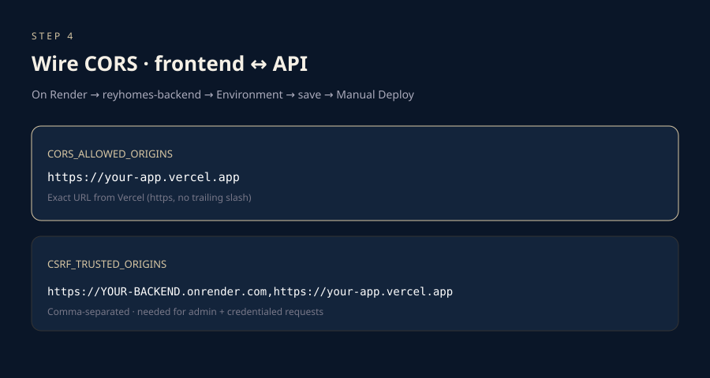
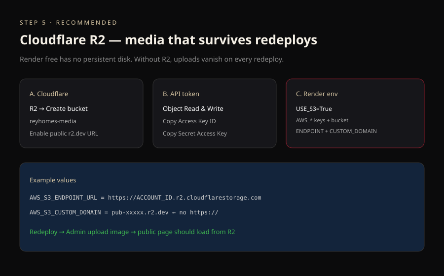
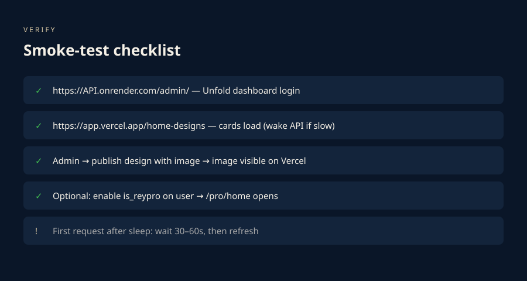

# Free deploy — step-by-step with screenshots

Open the diagrams in `docs/screenshots/` (SVG — works in any browser) while you follow the steps.



---

## Step 1 — GitHub



1. Unzip `reyhomes_full.zip` and open a terminal in `reyhomes_new/`.
2. Create a **new empty** repository on GitHub (no README required).
3. Run:

```bash
git init
git add .
git commit -m "ReyHomes free deploy"
git branch -M main
git remote add origin https://github.com/pasang-111/reyhomes.git
git push -u origin main
```

**Screenshot tip:** GitHub → green **New repository** → name `reyhomes` → Create → copy the remote URL into the commands above.

---

## Step 2 — Render (database + API + CMS)



1. Go to [dashboard.render.com](https://dashboard.render.com) → **New** → **Blueprint**.
2. Connect GitHub and select the `reyhomes` repo.
3. Render reads `render.yaml` and shows:
   - **reyhomes-db** (Postgres free)
   - **reyhomes-backend** (web free)
4. Fill **secret** env vars when prompted:
   - `DJANGO_SUPERUSER_USERNAME` → e.g. `admin`
   - `DJANGO_SUPERUSER_EMAIL` → your email
   - `DJANGO_SUPERUSER_PASSWORD` → strong password (**save it**)
5. Apply and wait until the web service is **Live**.
6. Open the service → **Environment** and set:
   - `ALLOWED_HOSTS` = `your-service-name.onrender.com` (no `https://`)
   - `CSRF_TRUSTED_ORIGINS` = `https://your-service-name.onrender.com`
7. **Manual Deploy** → clear build cache optional → Deploy.
8. Open **`https://your-service-name.onrender.com/admin/`** and log in.

You should see the **Unfold CMS dashboard** (KPIs, quick actions).

**Screenshot tip:** Render left sidebar → your web service → **Environment** tab is where CORS/hosts go.

---

## Step 3 — Vercel (frontend)



1. [vercel.com](https://vercel.com) → **Add New…** → **Project**.
2. Import the **same** GitHub repo.
3. Configure:
   - **Root Directory** → **Edit** → `frontend`
   - Framework: Next.js (auto)
4. **Environment Variables**:
   - Name: `NEXT_PUBLIC_API_URL`
   - Value: `https://your-service-name.onrender.com` (**no** trailing slash)
5. **Deploy**.
6. Copy the production URL, e.g. `https://reyhomes-xxx.vercel.app`.

**Screenshot tip:** Before deploy, expand “Root Directory” — if it stays `.` the build will fail or use the wrong app.

---

## Step 4 — Connect CORS



Back on **Render → Environment**:

| Key | Value |
|-----|--------|
| `CORS_ALLOWED_ORIGINS` | `https://reyhomes-xxx.vercel.app` |
| `CSRF_TRUSTED_ORIGINS` | `https://your-service.onrender.com,https://reyhomes-xxx.vercel.app` |

Save → **Manual Deploy** on the backend.

Then open the Vercel URL — homepage and `/home-designs` should call the API.  
If the API was asleep, wait ~30–60s and refresh.

---

## Step 5 — R2 media (recommended)



1. [Cloudflare Dashboard](https://dash.cloudflare.com) → **R2** → **Create bucket** → `reyhomes-media`.
2. Bucket **Settings** → Public access → allow **R2.dev** subdomain → copy host like `pub-xxxx.r2.dev`.
3. **Manage R2 API Tokens** → Create → Object Read & Write → copy **Access Key ID** + **Secret**.
4. Note **Account ID** on the R2 overview page.
5. Render **Environment**:

| Key | Value |
|-----|--------|
| `USE_S3` | `True` |
| `AWS_ACCESS_KEY_ID` | (token) |
| `AWS_SECRET_ACCESS_KEY` | (token) |
| `AWS_STORAGE_BUCKET_NAME` | `reyhomes-media` |
| `AWS_S3_ENDPOINT_URL` | `https://ACCOUNT_ID.r2.cloudflarestorage.com` |
| `AWS_S3_CUSTOM_DOMAIN` | `pub-xxxx.r2.dev` (no `https://`) |
| `AWS_S3_REGION_NAME` | `auto` |

Redeploy backend → Admin → upload an image on a Home Design → confirm it loads on Vercel.

---

## Verify



| Check | URL |
|-------|-----|
| CMS | `https://API.onrender.com/admin/` |
| Site | `https://app.vercel.app` |
| Designs | `https://app.vercel.app/home-designs` |
| Pro (after flag) | `https://app.vercel.app/pro/home` |

---

## Where the real product UIs live

These diagrams **simulate** the dashboards (GitHub / Render / Vercel / R2 change often).  
Your **actual** screens will match the same fields and labels; use this file as the field checklist while you click through each console.

More detail: [FREE_DEPLOY.md](../FREE_DEPLOY.md) · [DEPLOY.md](../DEPLOY.md)
